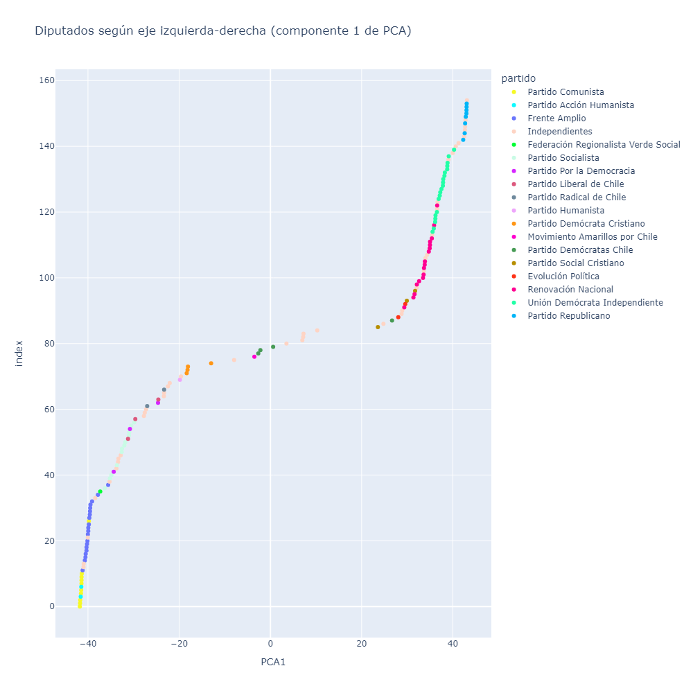

**IMPORTANTE: para poder visualizar los gráficos del _notebook_**
**[`analisis.ipynb`](analisis.ipynb), se debe descargar**
**[`analisis.html`](analisis.html) o utilizar**
**[el siguiente enlace de nbviewer](https://nbviewer.org/github/claugaete/clusters-congreso/blob/main/analisis.ipynb).**
**Al ser interactivos, los gráficos no cargan en el visualizador por defecto**
**de _notebooks_ de GitHub.**

En el presente repositorio se analizan las votaciones realizadas por la Cámara
de Diputadas y Diputados de Chile en su LVI periodo legislativo (iniciado el 11
de marzo de 2022). La metodología fue inspirada en
[FiveThirtyEight](https://projects.fivethirtyeight.com/types-democrats-republicans-house-2024/),
quienes realizaron un análisis similar para la Cámara de Representantes de los
Estados Unidos.

Los datos fueron obtenidos mediante
[Datos Abiertos Legislativos](https://www.camara.cl/transparencia/datosAbiertos.aspx),
debiéndose procesar los XML con el detalle de cada votación entre el 11 de
marzo de 2022 y la fecha de realización del análisis (13 de octubre de 2024).
La militancia actual de cada diputado también fue extraída de la plataforma. A
cada diputado se le asoció un número por cada votación realizada en el
Congreso: 1 si el diputado aprobó la moción, -1 si la rechazó, y 0 si se
abstuvo. Los valores faltantes (debido a ausencias de los diputados) se
calcularon usando **imputación** mediante KNN.

Luego, se realizó Principal Component Analysis (PCA) sobre la tabla resultante,
para asociar a cada diputado con una coordenada en 2 dimensiones que refleja
sus patrones de voto. Se encontró una clara asociación entre la primera
coordenada del PCA y la posición del diputado en el clásico eje
izquierda-derecha. Usando estos valores, se analizaron las tendencias de los
diputados y sus partidos políticos, incluyendo la cohesión de estos últimos a
la hora de votar.

Finalmente, se realizó un *clustering* utilizando K-Means con $k=5$, obteniendo
5 grupos de diputados que votan de manera similar. Cada grupo fue
posteriormente analizado, concluyendo que los *clusters* calzan con las
principales fuerzas políticas visibles al interior del Congreso.

